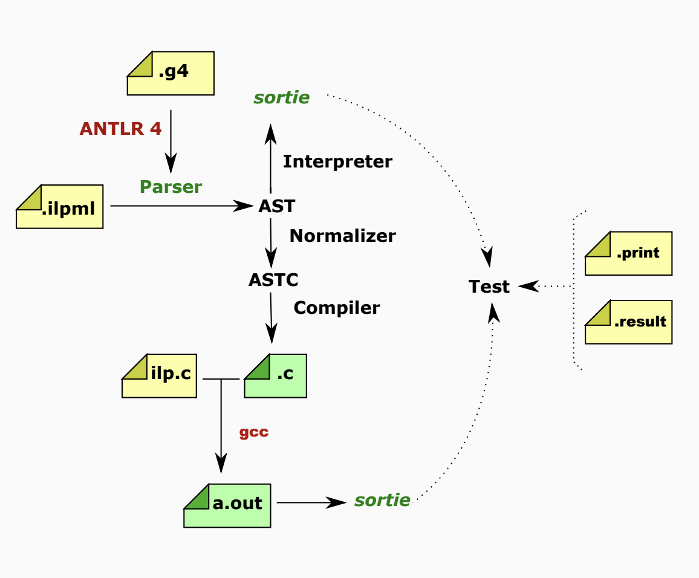
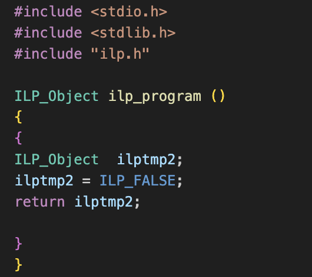
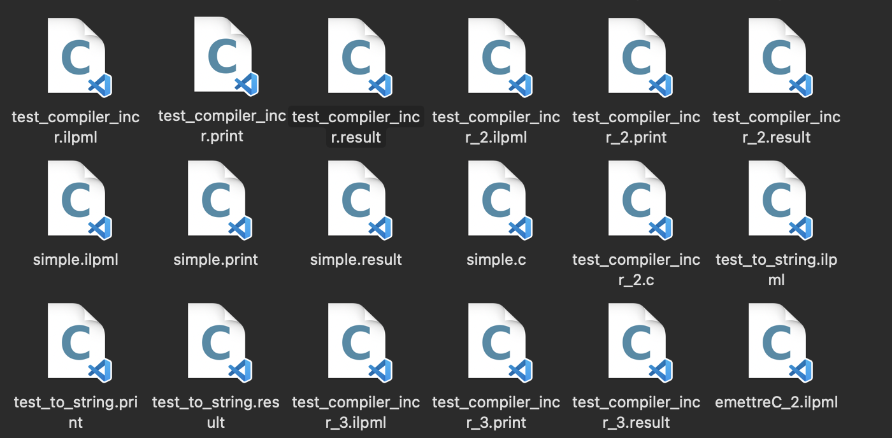
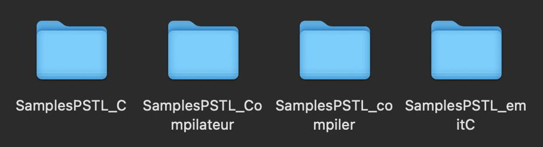
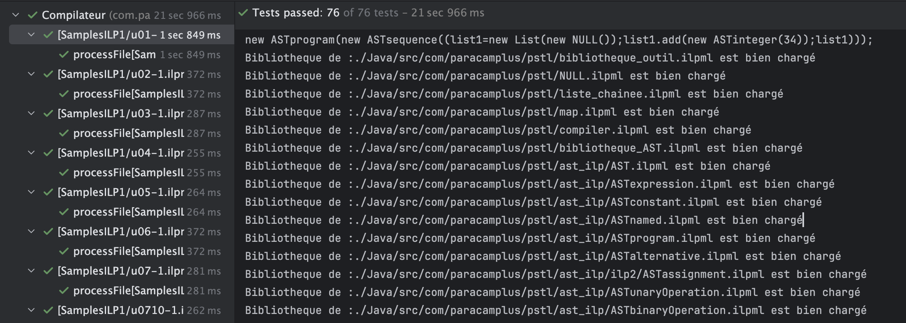

<br/>

<center>

# Rapport partiel de Recherche Du Projet STL
### Sujet:Implantation d’ILP en ILP
#### Encadrant : Antoine Miné
#### Groupe:   
Zhengdao Yu,  
Mengxiao Li,  
Shiyao Chen


<br>
<br>
<br>
<br>
<br>
<br>
<br>
<br>
<br>
<br>

<br>
<br>
<br>
<br>


22/03/2024
</center>

<div STYLE="page-break-after: always;"></div>

## Table des Matières
  - [1 Introduction](#1-introduction)
  - [2 Travail attendu](#2-travail-attendu)
  - [3 Méthode  de Travail en Collaboration](#3-méthode--de-travail-en-collaboration)
  - [4 Presentation des tâches déjà réalisées](#4-presentation-des-tâches-déjà-réalisées)
      - [4.1 Départ du Projet](#41-départ-du-projet)
        - [4.1.1 AST](#411-ast)
        - [4.1.2 Tâche initiale](#412-tâche-initiale)
        - [4.1.3 Notion NULL](#413-notion-null)
        - [4.1.4 Notion Liste chainée](#414-notion-liste-chainée)
        - [Bibliothèque List Chainée](#bibliothèque-list-chainée)
        - [List Chainée implanté](#list-chainée-implanté)
        - [AST implanté en ILPML](#ast-implanté-en-ilpml)
      - [4.2 Tâche actuellement : un mécanisme capable de compiler plusieurs fichiers](#42-tâche-actuellement--un-mécanisme-capable-de-compiler-plusieurs-fichiers)
        - [4.2.1 Notion "Include"](#421-notion-include)
        - [4.2.2 Notre solution Pour "Include"](#422-notre-solution-pour-include)
        - [4.2.3 Avant de implementation](#423-avant-de-implementation)
        - [4.2.4 L'implementation de "Include"](#424-limplementation-de-include)
        - [4.2.5 À completer](#425-à-completer)
  - [5 Tâches restantes + Re-tro Planning](#5-tâches-restantes--re-tro-planning)
      - [5.1 Appliquer l'implementation de Notion include et mecanisme de compiler multiple fichier en ILPML](#51-appliquer-limplementation-de-notion-include-et-mecanisme-de-compiler-multiple-fichier-en-ilpml)
      - [5.2 Développer une méthode d’analyse syntaxique permettant de convertir un code source texte à la syntaxe ILPML en AST représenté en ILP.](#52-développer-une-méthode-danalyse-syntaxique-permettant-de-convertir-un-code-source-texte-à-la-syntaxe-ilpml-en-ast-représenté-en-ilp)
        - [5.2 Planning](#52-planning)
      - [5.3 Développer, au choix, un compilateur d’ILP vers C ou un interprète d’ILP, en ILP](#53-développer-au-choix-un-compilateur-dilp-vers-c-ou-un-interprète-dilp-en-ilp)
        - [5.3 Planning](#53-planning)
      - [5.4 Développer des tests pour valider la correction de  compilateur ou interprète](#54-développer-des-tests-pour-valider-la-correction-de--compilateur-ou-interprète)
        - [5.4 Planning](#54-planning)
      - [5.5 Rapport final et preparation de la soutenance](#55-rapport-final-et-preparation-de-la-soutenance)
        - [5.5 Planning](#55-planning)


<div STYLE="page-break-after: always;"></div>

## 1 Introduction  
<div style="text-indent: 2em;">
ILP est un petit langage dynamique, appartenant à la même catégorie que Python, avec des types de données de base (tels que les entiers et les chaînes), des opérations intégrées, des fonctions globales et de premier ordre, un système d'exceptions et un système d'objets basé sur les classes. 
Ce langage est stratifié en plusieurs niveaux, allant de ILP1 (sans fonctions, exceptions, ni classes) à ILP4 (implémentation complète).  

ILP possède un interpréteur écrit en Java, et un compilateur également écrit en Java mais lié à la bibliothèque d'exécution C pour génerer les code en C.

Notre projet vise à réimplémenter partiellement le langage ILP en utilisant ILP lui-même pour la réécriture. Par exemple, réécrire l'interpréteur ILP ou le compilateur qui compile ILP en C en utilisant le langage ILP. De plus, bien qu'ILP offre des fonctionnalités avancées, il est imparfait à certains égards, comme l'absence de structures de données complètes, un manque de mécanisme de gestion de fichiers, et des fonctionnalités de sortie plutôt limitées. Ainsi, l'un de nos objectifs est également de compléter autant que possible ces aspects.
</div>


<br/>
<br/>
<br/>

<div STYLE="page-break-after: always;"></div>

## 2 Travail attendu
- Développer en ILP une structure de données pour représenter l’AST du langage ILP.

- Développer en ILP, au fur et à mesure des besoins, une bibliothèque de structures de données générales (listes chaînées, tables d’association, etc.).

- Développer une méthode d’analyse syntaxique permettant de convertir un code source texte à la syntaxe ILPML en AST représenté en ILP.

- Développer, au choix, un compilateur d’ILP vers C ou un interprète d’ILP, en ILP

- Développer un mécanisme de gestion de programmes
multi-fichiers en ILP

- Développer des tests pour valider la correction du compilateur ou d l'interprète

<br/>
<br/>
<br/>

<div STYLE="page-break-after: always;"></div>

## 3 Méthode  de Travail en Collaboration
Pour mieux coordonner notre travail d'équipe et progresser plus efficacement dans notre projet, nous avons pris les mesures suivantes :

1. Nous avons créé un dépôt GitHub pour partager le code.
2. Nous avons un channel de discussion de groupe pour discuter des idées.
3. Avant de commencer une nouvelle tâche, nous attribuons les tâches dans le channel de discussion pour travailler en parallèle.
4. Organiser des réunions régulières (vendredi matin) avec M.Antoine Miné pour discuter de l'avancement du projet et résoudre les problèmes éventuels.

En mettant en place ces mesures, nous pouvons améliorer la coordination et l'efficacité de notre travail d'équipe et avancer plus rapidement dans notre projet.

<div STYLE="page-break-after: always;"></div>

## 4 Tâches réalisées et additionnelles
#### 4.1 Départ du Projet
<div style="text-indent: 2em;">

##### 4.1.1 AST
Un __abrbre syntaxique abstrait (AST)__ est une structure de données arborescente représentant un programme. Chaque nœud interne représente une opération élémentaire du programme. Tels que if(else),while,class...


##### 4.1.2 Tâche initiale

Donc notre __tâche initiale__ consiste à trouver une structure de données pour représenter l'arbre AST dans le langage ILP, différente de la structure AST.class déjà existante implémentée en Java. Cette fois-ci, nous devons utiliser le langage ILP pour construire ces nœuds. 

##### 4.1.3 Notion NULL
ILP n'a pas non plus de notion de null.Donc tout d'abord, nous aimerions mentionner ici notre tentative concernant la notion de NULL. Nous l'avons donc considéré comme une classe vide pour l'implémenter :
```
class NULL extends Object {}
```
Et ensuite,avec le conseil de M.Antoine Miné,nous pourrons réduire le test de nullité à un test de class:
```
function is_null(x) type_of(x) == "NULL"
```
  
##### 4.1.4 Notion Liste chainée

<div style="text-indent: 2em;">

#####  Bibliothèque List Chainée

Une liste chaînée (Linked List) est une structure de données fondamentale qui organise les données sous forme de séquence de nœuds (Node). Chaque nœud contient deux parties : l'une pour stocker les données (telles que des entiers, des chaînes de caractères, etc.), et l'autre pour stocker une référence (ou pointeur) vers le nœud suivant de la séquence. À la fin de la liste chaînée, cette référence pointe vers une valeur nulle, indiquant qu'il n'y a plus de nœuds.

#####  List Chainée implanté

Lors de l'implémentation de ces structures AST, nous avons rencontré un nouveau problème : ILP ne dispose pas d'une structure de données de type liste chaînée.

Par exemple, pour des nœuds tels que ASTblock, ASTsequence, lorsque les paramètres dont ils ont besoin sont un tableau, en Java, nous pouvons simplement utiliser arguments[] pour les implémenter. Mais cela n'est pas possible dans ILP. Par conséquent, notre prochaine tâche consiste à développer une structure de données similaire à une liste chaînée.

</div>
Ici,dans la class du ASTsequence en Java,il existe une structure de tableau utilisé pour représenter la liste des instructions dans une séquence d'instructions:

```
public class ASTsequence extends ASTexpression implements IASTsequence {
    public ASTsequence (IASTexpression[] expressions) {
        this.expressions = expressions;
    }
    protected IASTexpression[] expressions;
    @Override
	public IASTexpression[] getExpressions() {
        return this.expressions;
    }
```
La structure de liste chaînée que nous avons implémentée dans ILP :
```

class ListNode extends Object {
    var value;  
    var next;   
    ...
}
```
```
class List extends Object{
    var head;

    // ajouter valeur a la fin du list
    method add(value) 
    ...

    method contains(value)
    ...

    method length()
    ...
}
```
Nous avons également écrit quelques tests pour vérifier si la liste chaînée fonctionne correctement pour ces ASTs:

```
let node = new ListNode(10,new NULL()) in
   list = new List(node) ;
   list.add(5);
  list.head.next.value
```

##### AST implanté en ILPML

En utilisant le concept de classe déjà implémenté dans ILP4,la notion "Null" et la liste chainée que nous avons implantés, nous pouvons utiliser des classes pour construire des nœuds AST dans ILP

Finalement, nous avons réussi à construire tous les nœuds AST basés du ILP1 en utilisant ILP lui-même

</div>
L'exemple AST et ASTexpression

```
class AST { }
```
```
class ASTexpression extends AST { }
```
Dans cet exemple, "ast" et "ast expression" sont deux classes vides(abstrait), mais elles sont extrêmement importantes car elles servent de point de départ et de base pour la construction de l'ensemble de l'arbre syntaxique abstrait (AST). 
De nombreuses autres classes AST suivantes, telles que "ast alternative" et "ast block", par exemple : `(if expression else expression) = expression`, sont toutes basées sur "ast expression".

Evidemment, dans les développements ultérieurs, nous pouvons ajouter quelques méthodes génériques dans AST et ASTexpression pour simuler des __interfaces__ ou des __classes abstraites__. Par exemple, nous pouvons utiliser la méthode __collecterVarGlobal()__ pour collecter les variables globales, ce qui est très important. Ici, nous n'avons pas besoin de implanter directement la logique de cette méthode, nous la laissons vide. Dans les AST qui étendent ultérieurement l'AST, nous pouvons utiliser le mot-clé __"super"__ pour réécrire la logique spécifique de la méthode.


Voici quelques exemples d'AST que nous avons implantés en ILPML:
Exemple de AST (if_else_)
```
ASTalternative:
class ASTalternative extends ASTexpression {
    var condition;
    var consequence;
    var alternant;

    method isTernary () 
    type_of(self.alternant) != "NULL";
}
```
Exemple de AST (operation d'arité 1)
```
class ASTunaryOperation extends ASTexpression{
    var operator;
    var operand;

	method getOperands() 
     let node = new ListNode(self.getOperand(),new NULL()) in
        let list = new List(node) in
        list;
}
```

#### 4.2 Un mécanisme capable de compiler plusieurs fichiers 
<div style="text-indent: 2em;">

Maintenant que nous avons la structure de liste chaînée,la class NULL,des structures AST.  Mais nous ne voulons pas mettre tout le code dans un unique fichier,c'est lourd.Nous voulons le séparer en plusieurs fichiers.Cela rend le code plus maintenable et plus réutilisable.

Cela introduit __une notion de "bibliothèque"__.Ce concept est courant dans les langages de programmation modernes populaires, comme les modules en JavaScript, les packages en Java et les "include" en C.

Dans ce projet, notre solution est inspirée par "Include" dans C.

</div>

##### 4.2.1 Notion "Include"
<div style="text-indent: 2em;">
Dans le langage C, "include" est une opération statique qui se produit avant la compilation du fichier. Le compilateur remplace le fichier inclus par son contenu textuel interne.
</div>

##### 4.2.2 Notre solution Pour "Include"
<div style="text-indent: 2em;">
Dans notre projet, nous nous sommes inspirés de la fonctionnalité "include" et avons utilisé le compilateur de syntaxe ANTLR pour mettre en œuvre une fonctionnalité similaire:

</div>

<br>

* Nous avons ajouté un mot-clé "Include" dans la grammaire pour inclure un chemin.
* Nous utilisons ANTLR pour analyser le contenu textuel du fichier inclus (code) - En fonction de Open/Read fichier.
* Le fichier traité par ANTLR renvoie un arbre de syntaxe abstraite (AST) représentant le programme.
* Après avoir traité tous les "include" et le texte actuel, nous obtenons une liste d'ASTprogramme.
* Maintenant que nous avons une liste d'ASTprogram, notre tâche n'est pas encore terminée. Nous devons fusionner ces ASTprograms en un seul ASTprogram, de sorte que notre compilateur/interpréteur n'ait à traiter qu'un seul astprogram, ce qui équivaudrait à traiter le code de plusieurs fichiers précédents.

##### 4.2.3 Avant de implementation
<div style="text-indent: 2em;">

Pour introduire le mécanisme de "Include", et conformément à la suggestion de Monsieur Antoine Mine, nous avons trouvé que __c'est important et utile de supprimer une limitation existante dans ILP__. Dans ILP, il y avait une contrainte sur l'ordre des définitions globales (fonctions globales, classes globales) et des expressions, à savoir que dans un programme, les définitions globales étaient toujours en haut du programme, suivies de diverses expressions.

Cependant, si nous voulons introduire le mécanisme d'inclusion, il est très utile de supprimer cette limitation. Parce que,en effet, après l'utilisation d'inclusion, il se peut que nous ayons des situations où les définitions globales du programme 1, les expressions du programme 1, les définitions globales du programme 2 et les expressions du programme 2 soient mélangées.

Nous avons réussi à supprimer cette limitation en modifiant la grammaire existante et en construisant l'AST correspondant. La clé consistait à ajouter "ou" "|" dans la grammaire existante.

</div>

grammaire actuelle：
```
prog returns [com.paracamplus.ilp4.interfaces.IASTprogram node] 
    : (elements_globalDef+=globalDef ';'? | elements_expr+= expr ';'?)* EOF ;
```

##### 4.2.4 L'implementation de "Include"
Un aperçu de grammaire:
```
globalDef returns [com.paracamplus.ilp2.interfaces.IASTdeclaration node]
    : def=includeDef #IncludeDefinition
    | def=globalFunDef # GlobalFunctionDefinition
    | def=classDef # ClassDefinition
    ;
includeDef returns [com.paracamplus.pstl.interfaces.IASTincludeDefinition node]
    :'include' body = STRING
    ;
```
Un aperçu de implementation en JAVA:
```
public Object visit(IASTincludeDefinition iast, ILexicalEnvironment lexenv)  {
		String filepath = iast.getFilepath();
		IncludeHandler handler = new IncludeHandler(factory);
        ...
		String content = readFichier.readIncludeFileContent(filepath);
		includeProgram = (IASTprogram) handler.parseIncludeContent(content);		
        ...
		return includeProgram;
	}
```
##### 4.2.5 Pour aller plus loin
<div style="text-indent: 2em;">
Mais nous ne nous contentons pas de simplement implémenter un mécanisme d'inclusion. Finalement, nous avons réussi à mettre en œuvre un mécanisme d'inclusion imbriquée, ce qui signifie que notre inclusion finale peut s'appliquer aux inclusions des fichiers inclus. En d'autres termes, des inclusions multiples.
</div>

#### 4.3 Convertisseur de JAVA AST à ILP AST
<div style="text-indent: 2em;">
Maintenant la prochaine etape de projet est de rechercher une méthode d’analyse syntaxique permettant de convertir un code source texte à la syntaxe ILPML en AST représenté en ILP.  
</div>
Il y a plusieurs possibilites:

* Ecrire directement en ILP un analyseur syntaxique de type « récursif descendant »
* développer un « backend » pour ANTLR, qui génère un code d’analyse
syntaxique en ILP au lieu de Java, ce qui permettrait de réutiliser les fichiers de grammaire originaux d’ILP.
* Ecrire en Java un convertisseur d’AST Java déjà construit en AST en ILP

<div style="text-indent: 2em;">
Finalement, nous avons décidé d'utiliser la troisième méthode, à savoir écrire une version Java d'un convertisseur, qui convertira la structure AST Java en la structure AST ILPML correspondante.  

Parce que pour la première méthode, il faut étendre les capacités de manipulation des chaînes de caractères en ILP (recherche, extraction de caractères et de sous-chaînes, conversion en entier, etc.) Pour l'instant, ILP manque pas mal de choses pour implémenter un tel analyseur.

Comparée à la deuxième méthode, la troisième solution semble être la plus réalisable et la plus claire pour nous. Notre idée est d'écrire un visiteur qui parcourt chaque AST Java et émet simultanément le code AST ILPML correspondant.

</div>

##### 4.3.1 Implementation du convertisseur
<div style="text-indent: 2em;">
Comme nous l'avons mentionné ci-dessus, "convertisseur" est en fait similaire au pattern "visiteur" en Java. Le processus de conversion de l'AST Java en AST ILP est en fait équivalent à la conversion du code AST Java en code ILPML.

Notre approche principale est donc la suivante : 

Tout d'abord, nous écrivons un visiteur en Java. Ce visiteur est appliqué à l'arbre AST de Java déjà construit pour parcourir l'ensemble de l'arbre AST. Chaque fois que ce visiteur rencontre un AST de Java, il produira une structure AST de ILP équivalente que nous avons définie à l'avance dans la première étape du projet. De plus, dans le visiteur, nous définirons un constructeur de chaînes (String builder) pour collecter le code ILPML produit, facilitant les appels futurs.

Nous vous fournissons quelques exemples dans notre convertisseur pour vous aider à comprendre mieux:

</div>

Exemple1 : ASTboolean
pour l'ASTboolean,la conversion est simple,nous récupérons la valeur du ASTboolean en Java,nous le assignons à notre ASTboolean en ILP.
Normalement,cette méthode print le code ILP tel que: "new ASTboolean(valeur)"
```
-- Méthode dans convertisseur
@Override
public Object visit(IASTboolean iast,ILexicalEnvironment lexenv) {
    sb.append("new ASTboolean(");
    sb.append(iast.getValue());
    sb.append(")");
    return null;
}

-- l'ASTboolean en ILP predefini,ASTboolean herite un attribut "var value"
pour stocker la valeur 
class ASTconstant extends ASTexpression
{
    var value;
}
class ASTboolean extends ASTconstant{}

```
Exemple2 : ASTunaryOperation

```

@Override
public Object visit(IASTunaryOperation iast, ILexicalEnvironment iLexicalEnvironment) throws EvaluationException {
    sb.append("new ASTunaryOperation(");
    sb.append("\"");
    sb.append(iast.getOperator().getName());
    sb.append("\"");
    sb.append(",");
    iast.getOperand().accept(this,null);
    sb.append(")");
    return null;
}
```

__Conclusion__:
Depuis les deux exemples ci-dessus, nous pouvons voir que la logique principale du visiteur est d'extraire les valeurs des variables pertinentes de l'AST Java, puis de les attribuer à notre AST ILP prédéfini, et enfin de enregistrer le code ILP.


##### 4.3.2 Difficultés rencontrées

Mais dans ce processus, nous avons également rencontré certaines situations difficiles à gérer, telles que l'utilisation des listes []. En Java, pour certaines variables d'attribut qui sont elles-mêmes des listes, Java peut les traiter facilement, par exemple en les déclarant comme String[] ou int[], mais si nous voulons convertir ces éléments en code ILP, nous devons appliquer notre propre structure de liste chaînée définie ici.

Nous vous fournissons une exemple pour vous expliquer comment nous gérer ces attributs de liste dans le convertisseur:

Exemple ASTsequence:

```

@Override
public Object visit(IASTsequence iast,ILexicalEnvironment lexenv) throws EvaluationException {
    compteur_list++;
    sb.append("new ASTsequence(");
    sb.append("(");
    String list_str = "list"+compteur_list;
    sb.append(list_str).append("=").append("new List(new NULL());");
    IASTexpression[] expressions = iast.getExpressions();
    for ( IASTexpression e : expressions ) {
        sb.append(list_str).append(".add(");
        e.accept(this, null);
        sb.append(");");
    }
    sb.append(list_str);
    sb.append(")");
    sb.append(")");
    return null;
}
```
Sequence représente une série d'expressions, donc dans ASTsequence, nous devons gérer les attributs de structure de liste. 
Notre approche est la suivante : 
En ILP, pour chaque endroit où nous avons besoin d'utiliser une liste, nous définissons une instance de liste chaînée. __Nous définissons cette instance de liste en la déclarant comme une variable globale__. La raison pour laquelle nous ne définissons pas la liste comme une variable locale à l'aide de __let .. in ..__ est que cela complexifierait le code, tandis que définir la liste comme une variable globale rend le code ILP plus claire.   

Cependant, un problème se pose : chaque fois que nous avons besoin d'une liste, nous définissons une variable globale pour cette liste, de sorte que les noms de ces variables de liste ne peuvent pas être répétés. 

Par conséquent, dans le convertisseur, nous introduisons un compteur : __compteur_liste__. À chaque fois que nous définissons une variable globale pour une liste, nous concatenons le nom de la liste à ce compteur pour produire un nom de variable unique. Ensuite, nous utilisons la méthode __add__ définie dans la liste pour remplir la liste que nous avons définie avec les valeurs de liste en Java. Enfin, dans la séquence ILP, nous retournons la variable globale de cette liste en tant qu'expression à cet endroit.

<div style="page-break-after: always;"></div>

#### 4.4 Compilateur
<div style="text-indent: 2em;">
Ensuite, vient l'étape la plus importante et l'objectif principal de tout le projet, qui est de développer, au choix, un compilateur d'ILP vers C ou un interprète d'ILP, en ILP, en s'inspirant de la structure du code Java.
</div>

##### 4.4.1 Notre choix 
Après mûre réflexion, ainsi qu'une période préliminaire de réflexion et d'apprentissage sur ce projet, nous avons finalement décidé d'utiliser le langage ILP pour ré-implementer un compilateur. Voici nos raisons :

- Dans l'ILP existant, il existe déjà une bibliothèque C pertinente, nous pouvons donc réutiliser directement ce code.
- Comme pour la tâche 4.3, nous avons déjà une idée préliminaire, à savoir un visiteur supplémentaire pour émettre le code C.
- De plus,la cible de compilation est le langage C ici,qui est de relativement plus haut niveau que l'assembleur,ce qui facilite beaucoup la generation de code.C'est donc notre meilleur choix.

##### 4.4.2 Idée principale
L'idée de base de notre compilateur est la suivante :
Pour réaliser un compilateur développé en langage ILP capable de compiler lui-même, nous devons d'abord utiliser un langage de programmation de haut niveau existant pour développer la première version exécutable du compilateur. Ici, nous avons choisi le langage C. En effet, il existe déjà une bibliothèque C complète dans la bibliothèque ILP, ce qui a grandement accéléré notre processus de développement.

##### 4.4.3 Processus de développment

Notre processus est le suivant : 
nous devons d'abord mettre en œuvre un visiteur similaire à notre convertisseur, capable de recevoir du code ILP et de produire du code C. Ensuite, nous compilons le code C pour obtenir le résultat final de la compilation.
C'est-à-dire que pour la version initiale du compilateur, le langage C sert de tremplin pour nous aider à générer le premier fichier exécutable.

Dans ce processus, nos principales tâches se concentrent sur plusieurs parties : 
- la première partie concerne le perfectionnement de la section bibliothèque, car lors de la compilation, nous devons être capables de traiter les primitives, de collecter les variables globales, de gérer le contexte de compilation, ainsi que la partie normalisation durant la compilation. 
- La deuxième partie concerne le développement de la section visiteur qui produit le code C. 
- La troisième partie est l'intégration finale du compilateur, qui est basée sur Java, nécessitant d'intégrer et d'encapsuler toute une série d'opérations allant de la réception du code ILP normal à la génération de l'AST Java, puis à la transformation en AST ILP, et enfin à la compilation en code C pour compiler le code C généré.

##### 4.4.4 Implementation en ILP
##### 4.4.4.1 Bibliotheque de compilation
##### 4.4.4.1 Bibliotheque de compilation : HashMap
Pour pouvoir gérer des informations telles que les primitives, les variables globales et les fonctions globales, nous avons besoin d'une structure capable de stocker des paires clé-valeur. Le Hashmap est une telle structure, où les données sont stockées sous la forme clé-valeur. Chaque clé individuelle correspond à une valeur unique.

Cependant, le langage ILP manque d'une telle structure, donc nous avons développé une telle structure basée sur les listes chaînées :
```
class MapNode extends Object {
    var key;
    var value;  
    var next;   
    ...
}

class Map extends Object{
    var head; 

    // ajouter valeur a la fin du map
    method add(key,value) 

    // recherche la value en fonction du key    
    method search(key)

    // mise a jour la value
    method update(key,value)

    //verifier si le map contient le key
    method contains(key)

}
```
##### 4.4.4.1 Bibliotheque de compilation : Environnement Global
Ainsi, dans notre bibliothèque de compilation, nous pourrons gérer de manière flexible les informations telles que les variables globales et les primitives. Par exemple :
```
binaryOperators = new Map(null);
binaryOperators.add("+","ILP_Plus");
binaryOperators.add("*", "ILP_Times");

class Primitive{
     ...
}

//env global
globalVariables_env = new Map(null);
globalVariables_env.add("pi", "ILP_PI");

globalFunctions_env = new Map(null);
globalFunctions_env.add("print", new Primitive("print", "ILP_print", 1));
globalFunctions_env.add("newline", new Primitive("newline", "ILP_newline", 0));
```


Grâce à HashMap, nous pouvons facilement relier ILP aux bibliothèques C déjà définies, par exemple en associant pi à ILP_PI dans la bibliothèque C.

##### 4.4.4.1 Bibliotheque de compilation : Contexte

Lors du processus de compilation, il est nécessaire de conserver le contexte de la compilation, où la __"destination"__ des valeurs dans l'environnement de compilation actuel est importante. 
Par exemple, dans l'expression __x = 1+2__, lors du processus de compilation, cela serait interprété comme suit : 
- une variable temporaire tmp1 = 1, 
- une variable temporaire tmp2 = 2, 
- une variable temporaire tmp3 = tmp1 + tmp2 = 3. 
- Ainsi, la "destination" de 3 dans ce cas serait x.'

Nous avons défini une classe pour simuler le contexte, qui est utilisée pour collecter des informations:
```
assignDestination ="";
noDestination = "";
returnDestination = "return "; 
voidDestination = "(void)";

class Context{
     var destination;
}
```

##### 4.4.4.2 Visiteur en ILP
Bien que la logique du visiteur du compilateur soit similaire à celle du convertisseur, où le convertisseur prend du code Java en entrée et produit du code ILP en sortie, cette fois-ci le visiteur du compilateur devrait accepter du code ILP en entrée et produire du code C en sortie. Cependant, il n'est pas facile de simuler en ILP un visiteur similaire à celui en Java.

Par conséquent, notre solution est de définir une méthode eval dans chaque classe d'AST ILP. Cette méthode sera utilisée pour réaliser une traversée récursive de l'AST de haut en bas, ce qui permettra de produire le code de sortie.

exemple: nouveau ASTprogram en ILP
```

class ASTprogram extends AST {
    var expression;

   method eval(context)
    (
    print("#include <stdio.h>");
    newline();
    print("#include <stdlib.h>");
    newline();
    print("#include \"ilp.h\"");
    ...

    print("ILP_Object ilp_program ()");
    newline();
    print("{");
    c = new Context(returnDestination);
    self.expression.eval(c);

    ...
```
l'ASTprogram est la structure la plus haute de l'arbre AST. Étant donné que ILP manque de fonctionnalités de langage plus avancées, notre code semble quelque peu lourd, par exemple, nous devons utiliser de nombreux newline() pour simuler les caractères de retour à la ligne (__\n__).

Le point le plus intéressant ici, que nous voulons mettre en avant, est la ligne "__self.expression.eval(c)__". __Cela représente le processus récursif de l'appel de la méthode eval depuis le haut de l'arbre vers le bas.__ Pendant ce processus, nous transmettons le __contexte__ pour sauvegarder l'environnement contextuel lors du passage, utilisé pour déterminer la "destination" finale du résultat.

Exemple de Code C génére Pour le code ILP ( false ):


##### 4.4.4.2 Visiteur en ILP : Normalizer
Au cours du processus de compilation, nous devons également gérer le processus de "normalisation". En fait, la normalisation est une étape très importante lors de la compilation. Par exemple :

Comme nous l'avons également introduit précédemment, lors de la compilation, nous créons des variables temporaires pour différentes valeurs, mais il y a un problème ici :

Pour les variables locales à l'intérieur d'un bloc de code, comme les différents blocs de code ont des portées différentes, il est possible que des variables portant le même nom existent dans différents blocs. Cependant, lors de la compilation, nous pouvons facilement être confondus par ces variables locales homonymes. À ce moment-là, nous devons normaliser le code, __c'est-à-dire que nous devons générer un identifiant unique pour chaque variable locale dans les blocs de code__, qui sera utilisé pour l'identification lors de la compilation. Nous devons stocker cette correspondance entre l'ancien nom et le nouveau nom lors de la compilation. C'est ici que nous utilisons la structure hashmap que nous avons développée pour stocker cette relation de mappage.

Exemple de gestion du normalisation:
ASTblock (qui represente le bloc du code):
```

 class ASTblock extends ASTexpression{
      ...
     method eval(context)
     (
            ......
        let old_varName = to_string(current.value.variable.name) in
        let new_varName = to_string(old_varName+valTmp) in
          
                print("ILP_Object ");
                //Normalization
                normalizationVariables.add(old_varName,new_varName);
            ...... 
            self.body.eval(context);
            .......

```
On peut voir ici que pour chaque variable locale dans les blocs de code, nous avons généré un nouveau nom unique, et nous avons stocké cette correspondance dans normalizationVariables, qui est une HashMap globale stockée dans le compilateur, utilisée pour gérer les informations globales.


##### 4.4.4.3 La premiere version du Compilateur en ILP
Enfin, nous avons terminé tous les préparatifs, y compris la bibliothèque, les visiteurs (convertisseurs, compilateurs) et notre dernier travail consiste à intégrer et encapsuler tout le code pour les tests.
Voici le processus de compilation du code ILP :

1. Nous recevons normalement le code ILP.
2. Nous utilisons ANTLR pour analyser le code ILP et générer un AST en Java.
3. À travers le convertisseur, nous transformons l'AST en Java en AST en ILP, produisant ainsi un nouveau code ILP.
4. Nous incluons notre bibliothèque ILP développée (AST en ILP, liste chaînée, hashmap, classe NULL, etc.), ce qui génère un nouveau code ILP.
5. Nous engageons le processus de compilation (ASTprogram.eval(contexte)), produisant un nouveau code ILP.
6. Nous repassons par ANTLR pour analyser le nouveau code ILP, ce qui produit du code C.
7. Nous compilons le code C généré et vérifions s'il y a des erreurs.
   
__Finalement, nous avons réussi à développer un compilateur capable de compiler du code ILP1 écrit en ILP.__

<div style="page-break-after: always;"></div>

## 5 Validation du projet : Test

#### 5.1 Les tests au fur et à mesure
Pour assurer une progression correcte du projet, nous avons continuellement écrit des tests tout au long du processus de développement pour tester les fonctionnalités que nous avons développées. 
Par exemple, comme nous vous l'avons montré précédemment, nous avons écrit plusieurs tests pour vérifier les structures telles que la liste chaînée.
À chaque fois que nous avons développé une nouvelle structure ou finalisé une méthode AST, nous avons écrit plusieurs tests pour vérifier si les fonctionnalités associées fonctionnaient correctement.

De même, pour certaines syntaxes/grammaires présentes dans ILP4 qui pourraient être ambiguës, nous avons également écrit des tests simples pour vérifier la validité de la syntaxe ILP4.

La méthode de validation de ces tests repose principalement sur les tests d'interprétation et de compilation déjà existants pour ILP. Le critère de réussite de ces tests est de vérifier si le code ILP que nous avons entré génère des erreurs.





#### 5.2 Validation du projet
Pour valider notre projet, c'est-à-dire pour valider le compilateur que nous avons développé, nous avons utilisé des échantillons de tests ILP1. Il y a un total de 76 tests. Si le code C généré par notre compilateur pour ces 76 tests peut être compilé avec succès, cela prouve que nous avons réussi à développer un compilateur écrit en ILP pour compiler ILP1.

En fait, au début, seulement environ la moitié des tests ont réussi. En examinant les messages d'erreur de compilation, nous avons analysé les raisons et corrigé le code. Finalement, nous avons réussi à compiler les 76 tests ILP1.


## 6 Les tâches non réalisées 
Nous avons déjà atteint l'objectif de base de ce projet, qui est de compléter la compilation complète de ILP1. Cependant, en réalité, si le temps le permet, le projet pourrait envisager des extensions de la cible vers des versions supérieures d'ILP. 
#### 6.1 Conclusion du projet: Bootstrap 
Le concept introduit ici est celui de __"bootstrap"__, c'est-à-dire que si nous voulons développer un compilateur pour ILP écrit en ILP lui-même, capable de compiler ILP, nous devons d'abord utiliser un autre langage de programmation de haut niveau existant pour aider au développement du fichier exécutable du compilateur initial, ici nous avons utilisé le langage C. 

__Le langage C a joué le rôle de "pont" dans le développement du compilateur ILP__, c'est-à-dire que pour la version initiale du compilateur, le processus interne est le suivant : 
- nous recevons du code ILP que nous transformons en code C, 
- puis nous compilons le code C pour obtenir le résultat de la compilation. 

Une fois que nous obtenons le fichier exécutable de cette première version du compilateur, nous n'avons plus besoin du langage C, car nous disposons désormais d'un fichier exécutable qui accepte le code ILP et produit un résultat. 

Ensuite, nous pouvons utiliser ce compilateur initial pour écrire un compilateur entièrement en langage ILP, que nous appelons la deuxième version du compilateur. 

__Et une fois que nous obtenons un compilateur écrit purement en langage ILP, nous pouvons alors utiliser davantage de fonctionnalités ILP pour l'améliorer, en développant de nouvelles versions de compilateurs sur la base du compilateur précédent, et ce processus est appelé "bootstrap"__. Ce processus est reflété dans notre projet, où nous continuons à améliorer les fonctionnalités de ILP2, ILP3, ILP4 sur la base du compilateur ILP1. C'est aussi l'objectif le plus idéal et le plus intéressant de notre projet.


Merci de votre attention!